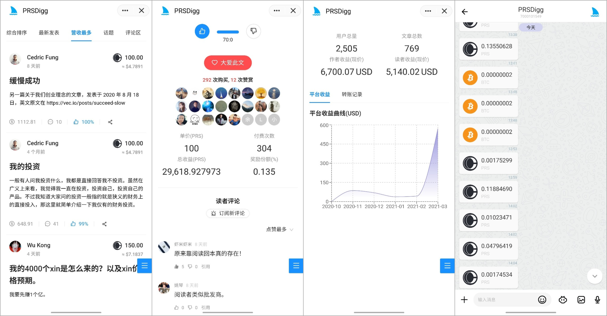

# PRSDigg

   

[中文](README-CN.md)

---

## Snapshot



---

PRSDigg is a Dapp built on [Mixin Network](https://mixin.one/). All payments and transfers will be completed through  [Mixin Network](https://mixin.one/) with **ZERO** gas. 

## Rules

PRSDigg tries to build a win-win **platform** for both **authors** and **readers**.

We believe that the value of an article is composed of both the author and the reader, but the actual situation is that the reader's contribution, especially the early readers' contribution,is not well represented. Therefore, the biggest difference between PRSDigg and other platforms is that PRSDigg introduces an **early reader rewards** mechanism.

The specific rules are as follows,

1. Users can publish articles on the **platform** and become **authors**.
2. All articles are paid articles, priced by *PressOne Token* or *Bitcoin*.
3. Users can pay for the articles, i.e. become a **reader** of a article.
4. For every new income from an article, 40% will be allocated to each **early reader** on a pro-rata basis as **Early Reader Bonus** , 10% will be a handling fee for the **platform**, and the rest will be revenue for the **author**.
5. **Readers** can also increase the amount they pay for an article by means of a reward in order to increase their share of the bonus.

For example: 

User A published an article X pricing 100 Satoshi on the platform. 

User B paid 100 Satoshi for article X and got the right to read the article. 

Therefore, article X earned 100 Satoshi, because B is the first reader and there is no earlier reader, so there is no early reader bonus; 10 Satoshi(10%) is used as the platform's handling fee; The remaining 90 Satoshi are all taken as author revenue and transferred to the account of author A.

User C paid 100 Satoshi for article x after B. As a result, Article X earns another 100 Satoshi.

Among them, 40 Satoshi(40%) will be used as an early reader bonus. At this time, there is only one early reader,  user B, so B monopolizes this 40% reward; The platform also receives 10 Satoshi(10%) as a handling fee; The remaining 5 Satoshi is the author's income. 

After C, user D also paid 100 Satoshi for article X.

Similarly, 4 Satoshi(40%) will be rewarded as early readers bonus. At this time, there are two early readers, namely B and C, who paid 100 Satoshi for article X before, so both B and C will be rewarded with `40 * 100/(100+100) = 2` Satoshi respectively. 

The platform also charges 10 Satoshi(10%) as a handling fee; The remaining 50 Satoshi is the author's income. 

And so on. 

It is worth reminding that besides the payment for articles, the income from other payment behaviors (such as reward) will also be included in the distribution ratio of early readers' bonus. 

## Experience 

At present, PRSDigg only supports [Mixin Messenger](https://mixin.one/messenger) login and payment. Please download and install it before experiencing PRSDigg.

Browse [prsdigg.com](https://prsdigg.com/), or search for Bot 7000101549 in [mixin messenger](https://mixin.one/messenger).

## API

User can generate access token in [dashboard settings](https://prsdigg.com/dashboard/settings).

Use access token in a HTTP Header named `X-Access-Token`.

API Endpoint is `https://prsdigg.com/api`

`GET | /articles`

When access token or `author_id` provided, it returns user's articles, otherwise, it return all published articles.

Available params: `author_id`, `offset`, `order`, `limit`, `query`.

Example: [https://prsdigg.com/api/articles?limit=5&order=asc&offset=2021-01-18T07:41:36.624Z&query=BTC,Xin](https://prsdigg.com/api/articles?limit=5&order=asc&offset=2021-01-18T07:41:36.624Z&query=BTC,Xin)

`GET | /article/:uuid`

Article content will not provied unless valid access token provided.

`POST | /articles`

Create a new article with valid access token.

Request body example:

```json
{
  "title": "article title",
  "content": "some article content",
  "intro": "some article introduction",
  "price": 0.000001,
  "asset_id": "c6d0c728-2624-429b-8e0d-d9d19b6592fa"
}
```
