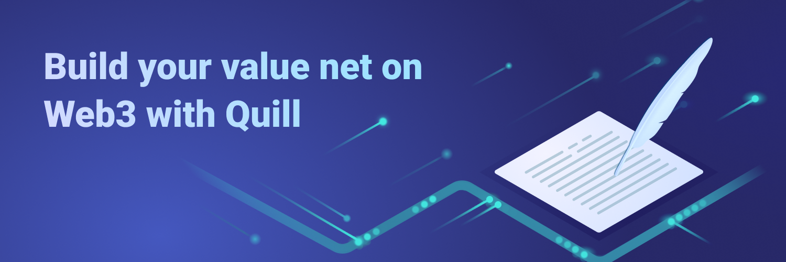

# Quill

  

[中文](README-CN.md)

Quill is building a **value net** on the Web3 for both authors and readers.

## Rules

Quill's differentiator is the **early reader rewards** mechanism: for every new income from an article, **40%** is split pro-rata among earlier readers, **10%** is the platform fee, and **50%** goes to the author. Tips count toward the early-reader pool the same way article payments do.

| Role | What they do |
|------|--------------|
| **Author** | Publishes paid articles priced in Bitcoin, _XIN_, _ETH_, or _pUSD_ (see `config/settings.yml` → `supported_assets`). |
| **Reader** | Pays to unlock an article. Can tip more to grow their share of future early-reader pools. |

### Example

Author A prices article X at 100 sats. Readers B, C, and D each pay 100 sats in order:

| Reader | Paid | Platform 10% | Author 50% | Early-reader pool 40% | Distribution |
|--------|-----:|-------------:|-----------:|----------------------:|--------------|
| B (1st) | 100 | 10 | 90 | 0 | No earlier readers → pool unspent |
| C (2nd) | 100 | 10 | 45 | 40 | B is the only earlier reader → B gets 40 |
| D (3rd) | 100 | 10 | 45 | 40 | B and C paid equally → each gets 20 |

## Experience

Open [quill.im](https://quill.im/), connect your wallet via MetaMask, Coinbase or WalletConnect.

## API

Generate an access token in [dashboard settings](https://quill.im/dashboard/settings) and send it as the `X-Access-Token` header. The API root is `https://quill.im/api`.

`GET | /articles`

With an access token or `author_id`, returns the user's articles; otherwise, returns all published articles. Params: `author_id`, `offset`, `order`, `limit`, `query`.

Example: [https://quill.im/api/articles?limit=5&order=asc&offset=2021-01-18T07:41:36.624Z&query=BTC,Xin](https://quill.im/api/articles?limit=5&order=asc&offset=2021-01-18T07:41:36.624Z&query=BTC,Xin)

`GET | /articles/:uuid`

Article body is included only when a valid access token is supplied.

`POST | /articles`

Create a new article (requires a valid access token).

Request body example:

```json
{
  "title": "article title",
  "content": "some article content",
  "intro": "some article introduction",
  "price": 0.000001,
  "asset_id": "c6d0c728-2624-429b-8e0d-d9d19b6592fa",
  "tag_names": ["BTC", "Blockchain"]
}
```

## Development

- Ruby 4.0.5
- Rails 8.1.3
- PostgreSQL for local/CI tests
- Node.js 18+ and Bun 1.x for the asset pipeline (see `.node-version` and `mise.toml`)

```bash
bundle install
bun install
bin/rails db:setup
bin/rails test
```
